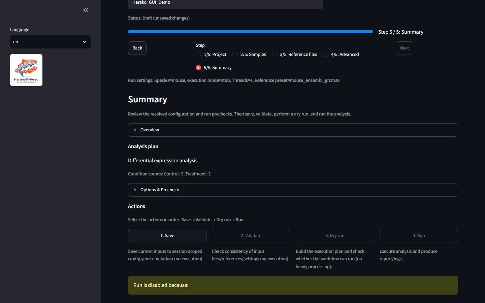

# Harako-RNAseq

<p align="center">
  
</p>

[Japanese README](README.ja.md) | [Documentation](docs/index.md)

Project website: <https://do-shima.github.io/harako-rnaseq/>

Harako-RNAseq is a Docker-based graphical workflow for reproducible, local
bulk RNA-seq analysis using fastp, Salmon, tximport, DESeq2, and self-contained
HTML reporting.

**Public beta | Source-available | Academic and permitted noncommercial use**

Harako is intended for researchers and analysts running small-to-medium bulk
RNA-seq studies on a local workstation. It is a local, single-user application,
not a hosted multi-user service. Windows with Docker Desktop and Ubuntu/Linux
with Docker are verified. The current image architecture is `linux/amd64`;
macOS has not yet been verified for this release.

Users remain responsible for experimental design, biological independence,
reference selection, privacy, and scientific interpretation. Harako is not a
substitute for expert review.

## GUI preview

<p align="center">
  <a href="site/assets/screenshots/gui-summary-en.webp">
    
  </a>
</p>
<p align="center">
  Representative Harako-RNAseq interface using synthetic demonstration data.
  No real biological data are shown.
</p>

## Overview

The Streamlit GUI prepares a normalized sample table, selects a verified
reference or custom files, freezes a reproducible run configuration, and
starts a resumable Snakemake workflow. Harako supports single-end and
paired-end FASTQ input plus supported SRA/ENA acquisition workflows for human,
mouse, and rat studies.

After Salmon transcript-level quantification using the selected Salmon index,
tximport produces gene-level counts and gene-level TPM as an abundance measure.
The library protocol must be selected explicitly; Harako does not infer it.
Full-length RNA-seq uses original tximport estimated counts with the
effective-length correction constructed by `DESeqDataSetFromTximport`.
3′-tag RNA-seq uses original estimated counts without length correction.
DESeq2 uses counts, never TPM. Inputs that pass structural validation but do
not meet the minimum sample-count requirements continue in QC-only mode without
p-values or adjusted p-values.

## Features

- FASTQ discovery with selected-subdirectory scanning.
- Editable sample table and paired-end auto-pairing.
- Consistent condition normalization with manual review.
- Checksum-pinned Ensembl presets for human, mouse, and rat.
- Custom transcript FASTA, genome FASTA, and GTF support.
- fastp preprocessing and Salmon transcript quantification.
- Gene-level tximport counts and gene-level TPM as an abundance measure.
- DESeq2 differential expression analysis when the minimum sample-count
  requirements are met.
- QC-only mode for structurally valid designs that do not meet those
  requirements.
- Optional enrichment when inferential DE results are available.
- Session-isolated drafts and immutable run-local configuration.
- Reproducible run identity, provenance, logs, and captured versions.
- Bilingual English/Japanese Streamlit interface.
- Self-contained HTML report with no required external web assets.

## Quickstart

The exact release image is the recommended installation method for most users
and for reproducible research. The moving `beta` image is also available for
users who intentionally want the current beta channel.

### Ubuntu and Linux: exact release image

```bash
mkdir -p input output
docker pull ghcr.io/do-shima/harako-rnaseq:v0.3.0-beta.1
docker run --rm -p 127.0.0.1:8501:8501 \
  -e PYTHONPATH=/app -e "HOST_INPUT=$(pwd)/input" -e "HOST_OUT=$(pwd)/output" \
  --mount "type=bind,src=$(pwd)/input,dst=/input,readonly" \
  --mount "type=bind,src=$(pwd)/output,dst=/output" \
  ghcr.io/do-shima/harako-rnaseq:v0.3.0-beta.1 \
  streamlit run app/ui/app_ui.py --server.address 0.0.0.0 \
  --server.port 8501 --server.headless true --browser.gatherUsageStats false
```

### Windows PowerShell: exact release image

```powershell
$InputDir = "D:\rna\input"
$OutputDir = "D:\rna\output"
New-Item -ItemType Directory -Force $InputDir, $OutputDir | Out-Null
docker pull ghcr.io/do-shima/harako-rnaseq:v0.3.0-beta.1
docker run --rm -p 127.0.0.1:8501:8501 `
  -e PYTHONPATH=/app -e "HOST_INPUT=$InputDir" -e "HOST_OUT=$OutputDir" `
  --mount "type=bind,src=$InputDir,dst=/input,readonly" `
  --mount "type=bind,src=$OutputDir,dst=/output" `
  ghcr.io/do-shima/harako-rnaseq:v0.3.0-beta.1 `
  streamlit run app/ui/app_ui.py --server.address 0.0.0.0 `
  --server.port 8501 --server.headless true --browser.gatherUsageStats false
```

Start Docker or Docker Desktop first, then open `http://127.0.0.1:8501`.
Input is mounted read-only at `/input`; output is mounted read-write at
`/output`. To follow the moving beta channel, replace the exact tag with
`ghcr.io/do-shima/harako-rnaseq:beta`.

For development or source modification, clone the repository and use
`just app` on Linux or `just app-ps` in PowerShell. Those commands use the
source checkout and local-build path.

See [Installation](docs/installation.md) for explicit mounts, resources,
platform status, port forwarding, and first-build guidance.

## Typical workflow

1. **Project:** name the study, select input subdirectories, and explicitly
   select full-length or 3′-tag RNA-seq.
2. **Samples:** review FASTQ discovery, pairing, sample IDs, and conditions.
3. **Reference files:** select a built-in Ensembl preset or custom files.
4. **Advanced:** choose applicable contrasts and enrichment settings.
5. **Summary:** use Save, Validate, Dry run, then Run.

Each browser session keeps its draft state separate. Starting a run freezes the
normalized sample table, executable configuration, analysis plan, and reference
provenance under that run. Resume and Recover use this frozen configuration,
not later UI edits.

See [Using Harako-RNAseq](docs/usage.md) for the GUI and run lifecycle, or
[SRA and ENA input](docs/sra-ena.md) for accession acquisition.

## Controlled agent-ready interface

**v0.3.0-beta.1** includes a controlled machine-readable CLI for local
automation tools such as Codex. Biological conditions are never inferred:
sample assignments must be explicit, and execution requires confirmation using
the exact approval hash. Harako validates and executes the supported scientific
workflow. Automation tools may coordinate review steps, but they do not
determine analysis eligibility or replace Harako's execution path.

Harako remains fully usable without an agent and contains no OpenAI client,
model call, API key, or cloud AI dependency. See the
[agent workflow and safety contract](docs/agent-workflow.md) and the complete
[Codex-assisted example](docs/agent-assisted-analysis.md).

## Supported analysis modes

### Differential expression analysis

DESeq2 differential expression analysis requires:

- at least two distinct conditions; and
- at least two valid samples in every condition.

When these minimum sample-count requirements are met, runs retain the configured
contrast behavior. Enrichment can run only when inferential differential
expression results are available and its own prerequisites pass.

### QC-only analysis

Structurally valid one-condition designs or designs with fewer than two samples
in any condition run in QC-only mode. They retain preprocessing,
quantification, gene-level counts, gene-level TPM as an abundance measure,
DESeq2 normalization when technically possible, applicable PCA and
sample-distance QC, and reporting.

In QC-only mode, inferential contrasts are inactive, p-values and adjusted
p-values are not calculated or reported, differential expression plots are not
produced, and enrichment is not run. `deseq2/results.tsv` is header-only;
`deseq2/status.json` records the mode and actual artifact availability.

Having at least two conditions with two valid samples each is only the minimum
enforced by the software. It is not a power calculation and does not establish
biological independence or experimental-design validity.

## Main outputs

Every run retains stable workflow artifacts, including:

- `fastp/`: processed reads and fastp JSON/HTML QC.
- `salmon/<sample>/quant.sf`: transcript quantification.
- `tximport/txi.tsv`: gene-level count matrix.
- `tximport/tpm.tsv`: gene-level TPM as an abundance measure when available.
- `deseq2/status.json`: analysis mode and artifact availability.
- `deseq2/results.tsv`: DE rows, or a stable header only in QC-only mode.
- `deseq2/normalized_counts.tsv`: DESeq2-normalized counts when available.
- `report/report.html`: self-contained analysis report.
- `run/`: frozen configuration, sample metadata, manifest, logs, and versions.

Exact paths and mode-dependent behavior are documented in the
[Output reference](docs/output-reference.md).

## Documentation

Start with the [documentation index](docs/index.md).

- [Installation and resources](docs/installation.md)
- [GUI usage and recovery](docs/usage.md)
- [SRA/ENA acquisition](docs/sra-ena.md)
- [Scientific methods](docs/scientific-methods.md)
- [Reference presets](docs/reference-presets.md)
- [Outputs](docs/output-reference.md)
- [Troubleshooting](docs/troubleshooting.md)
- [Advanced usage](docs/advanced-usage.md)
- [Agent-ready workflow](docs/agent-workflow.md)
- [Architecture](docs/architecture.md)
- [Support matrix](docs/support-matrix.md)
- [Limitations](docs/limitations.md)
- [Scope relative to nf-core/rnaseq](docs/comparison-nf-core-rnaseq.md)

## System requirements

### Using the published image

- Docker with a running Linux container engine.
- A web browser with local access to port 8501.
- An amd64-capable environment for the current image.
- Sufficient memory and disk for FASTQ files, uncompressed fastp
  intermediates, reference caches, Salmon indexes, quantification, and reports.

### Building from source

- Git, Docker with a running Linux container engine, and `just`.
- The same browser, architecture, memory, and disk requirements as the
  published-image path.

Native non-Docker execution and hosted multi-user deployment are not supported.
Intel-based macOS has not yet been verified, and the current image is not a
native Apple Silicon/arm64 image. See the
[support matrix](docs/support-matrix.md).

## Scientific limitations

- The built-in condition model does not support batch, pairing, repeated
  measures, covariates, or interactions.
- Meeting the minimum sample-count requirements does not establish adequate
  statistical power, biological independence, or experimental-design validity.
- Salmon quantifies transcripts; tximport summarizes to genes.
- DESeq2 uses gene-level counts, not TPM.
- Built-in hashes identify exact reference files but do not prove that an
  assembly is appropriate for a study.
- Custom-reference compatibility remains the user's responsibility.
- Small-to-medium dataset positioning is operational guidance, not a hard
  biological size boundary.

Review [Scientific methods](docs/scientific-methods.md) and
[Limitations](docs/limitations.md) before interpreting results.

## License and permitted use

Harako-RNAseq is source-available under the
[PolyForm Noncommercial License 1.0.0](LICENSE).

It may be used, modified, and redistributed for permitted noncommercial
purposes, including academic, educational, and public research use, subject to
the license terms.

Commercial use, commercial services, resale, and use for an anticipated
commercial application are not granted by this license and require a separate
written license or permission. See [Commercial licensing](COMMERCIAL_LICENSE.md).

Third-party tools and libraries used by or distributed with Harako-RNAseq
remain subject to their respective licenses. See
[Third-Party Notices](THIRD_PARTY_NOTICES.md).

## Origins and acknowledgements

### Name and design principle

Harako-RNAseq takes its name from *harako*—salmon roe—and also acknowledges
[ikra](https://github.com/yyoshiaki/ikra), the Salmon-centered RNA-seq pipeline
that inspired the project. HARAKO is also used as a backronym for:

**HARAKO: Human-Auditable, Reproducible Analysis Kit and Orchestrator**

This adopted interpretation describes the current design philosophy:

- **Human-Auditable:** sample and condition assignments, analysis plans,
  exact execution approval, provenance, and artifacts can be reviewed by a
  person.
- **Reproducible:** the Docker environment, frozen Run configuration, tool
  versions, reference provenance, and checksum-pinned references are recorded.
- **Analysis Kit:** the GUI, CLI, Snakemake workflow, reports, and supporting
  tools form an integrated bulk RNA-seq analysis kit.
- **Orchestrator:** validation, dry run, controlled Snakemake execution,
  status and output inspection, and optional agent orchestration are managed
  without transferring scientific responsibility from the user.

“Human-Auditable” means that relevant inputs, decisions, plans, provenance,
and outputs are inspectable by a person; it does not certify scientific
validity automatically. The backronym was adopted to explain the existing
name and did not precede the Japanese name historically.

Harako-RNAseq is an independently implemented project that develops the ikra
inspiration with a graphical user interface, cross-platform Docker operation,
reproducible run management, differential expression and quality-control
workflows, and self-contained reporting. Harako-RNAseq is not an official
successor to, or endorsed by, the ikra project.

### AI-assisted development

Development of Harako-RNAseq was assisted by OpenAI Codex for implementation,
refactoring, test generation, documentation, debugging, and code review.
All scientific interpretations, architectural decisions, validation,
licensing decisions, and release decisions were made and approved by the
project maintainer. AI-generated suggestions were reviewed before inclusion
in the repository.

This acknowledgement does not imply endorsement, sponsorship, or certification
of Harako-RNAseq by OpenAI.

The engineering provenance audit is documented in
[docs/provenance.md](docs/provenance.md).

## Citation

If you use Harako-RNAseq, cite the software release using
[CITATION.cff](CITATION.cff). The current public-beta version is
`0.3.0-beta.1`.

## Support and issue reporting

Read [SUPPORT.md](SUPPORT.md) before opening a public
[GitHub Issue](https://github.com/do-shima/harako-rnaseq/issues). Include the
Harako version or commit, OS, Docker version, launch command, pipeline stage,
expected and actual behavior, and sanitized logs or support-bundle details.

Never upload FASTQ files, patient information, credentials, confidential
paths, or identifiable sample data to a public issue. Security vulnerabilities
use the private route in [SECURITY.md](SECURITY.md), not ordinary support.
